# Fluss — Deutsch im Fluss  ·  адаптивный тренажёр немецкого A1–A2

Заходишь и нажимаешь одну кнопку. Тренажёр сам решает, что тебе повторять: **одно задание за раз, мгновенно «верно / неверно»**,
а за кулисами **Gemini** запоминает твои ошибки, объясняет их, придумывает новые предложения и слова, озвучивает немецкий
и рисует картинки к словам. Когда правило освоено, тренажёр переходит к следующему — ты просто растёшь.

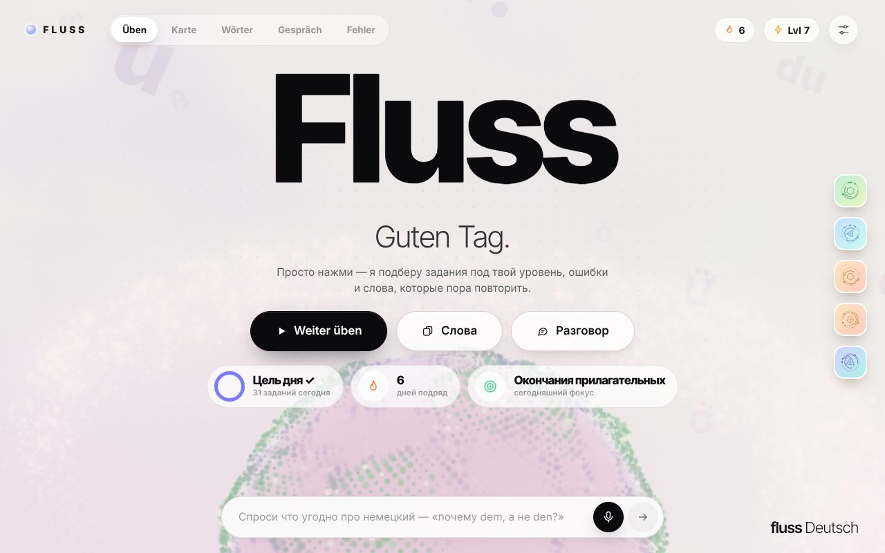

| Собери предложение | Раздели по артиклям | Заполни таблицу |
|---|---|---|
| 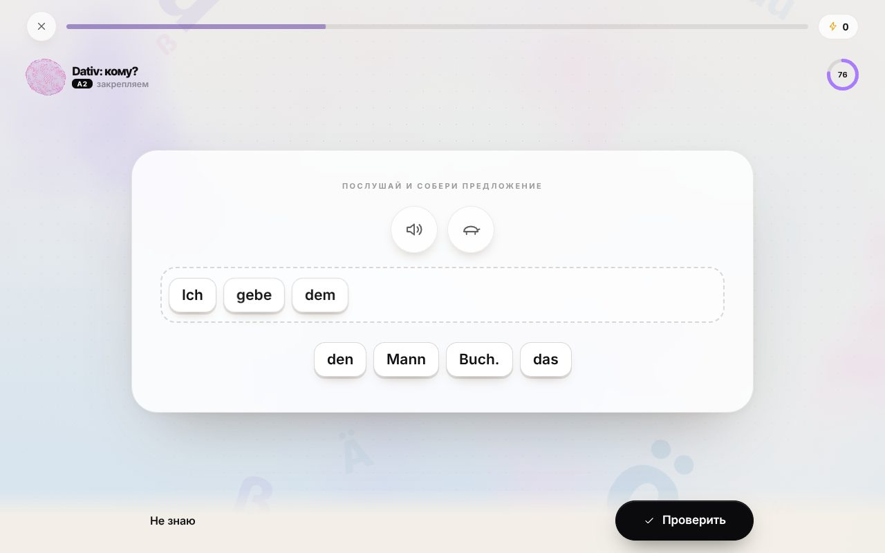 | 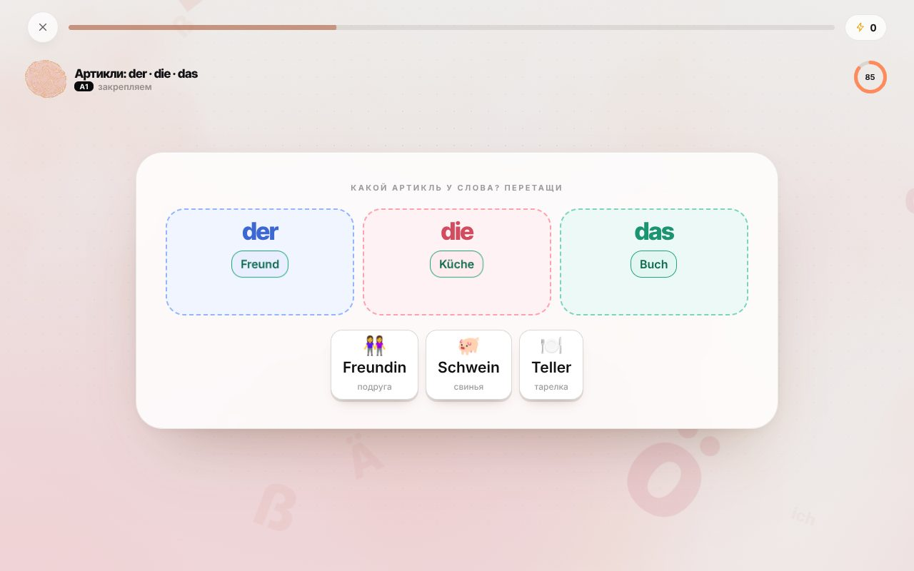 | 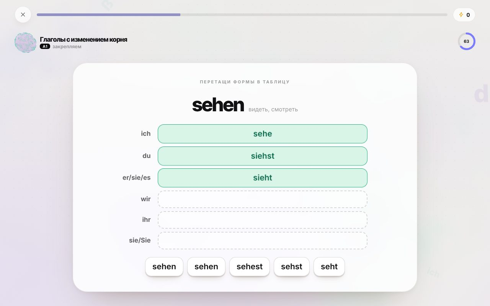 |

| Найди пары | Найди ошибку | Объяснение ошибки от ИИ |
|---|---|---|
| 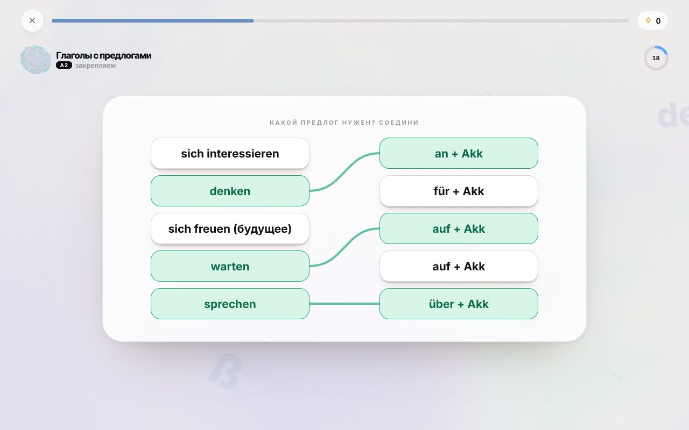 | 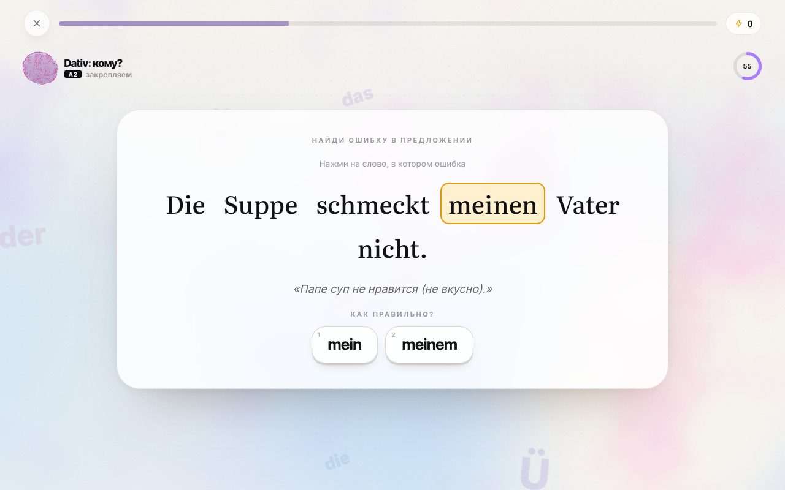 | 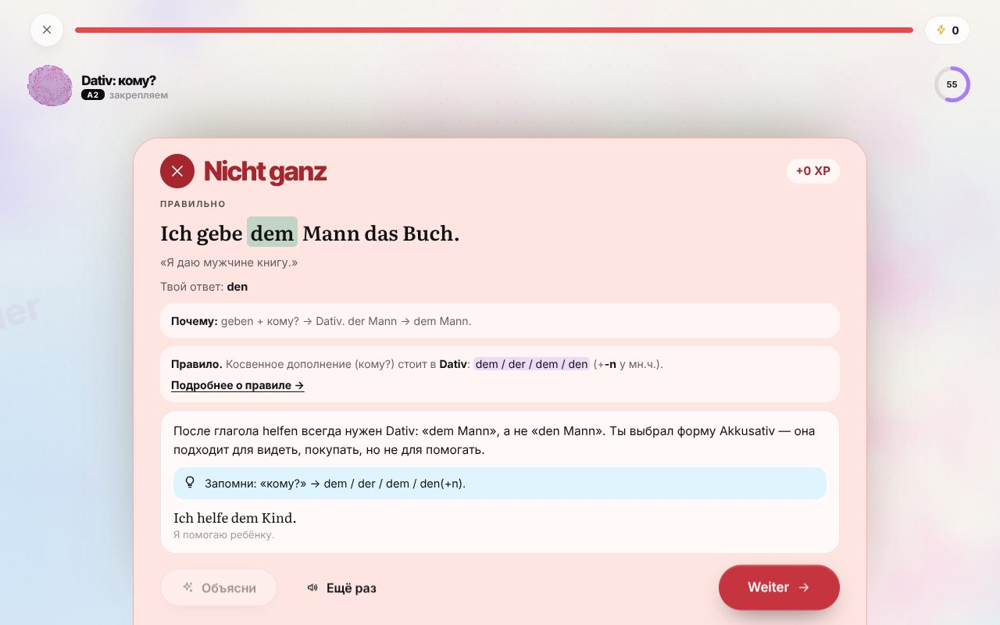 |

| Карта правил | Слова | Разговор с исправлением | Память ошибок |
|---|---|---|---|
| 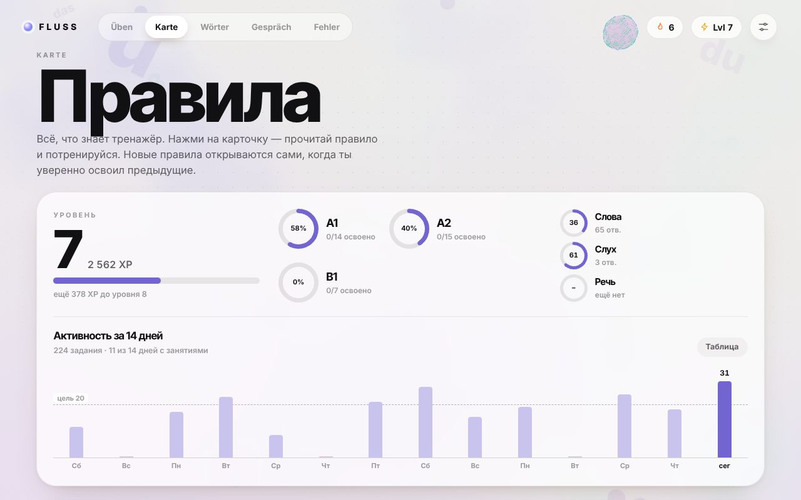 | 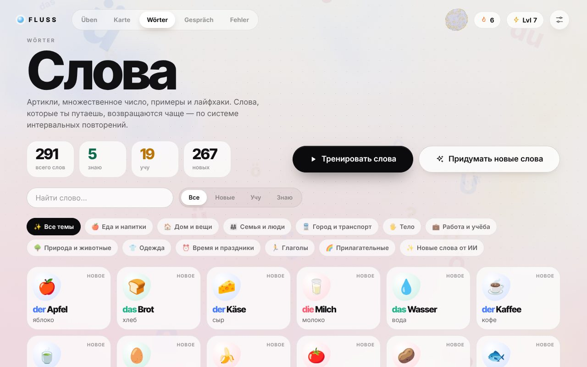 | 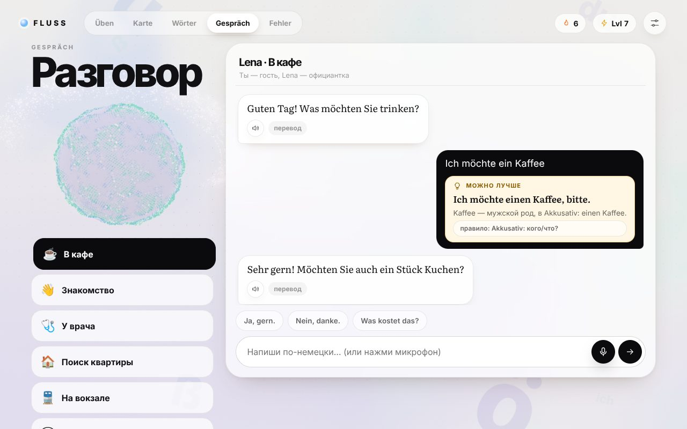 | 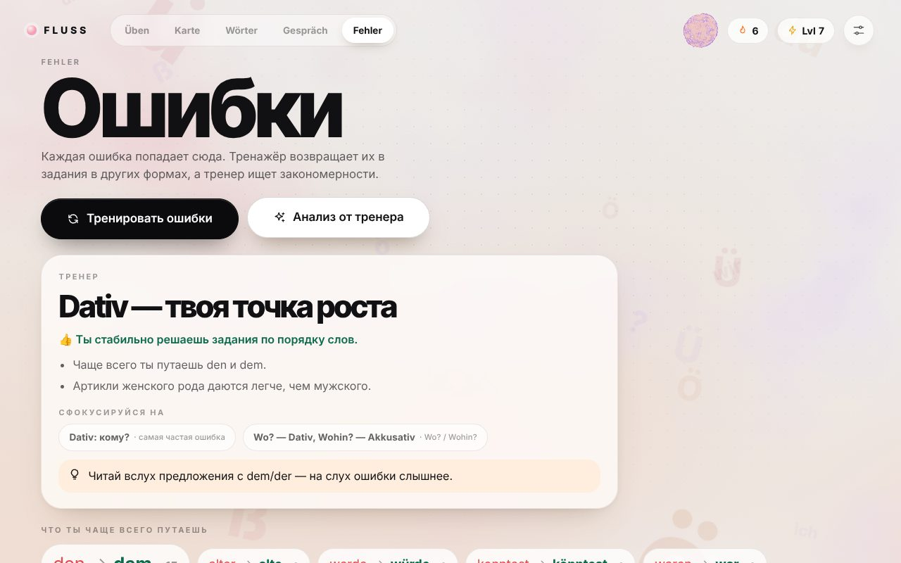 |

## Что внутри

- **36 правил**: 14 для A1, 15 для A2 и 7 «взглядов вперёд» на B1 — артикли, спряжение, порядок слов, Akkusativ/Dativ, предлоги,
  Perfekt и Präteritum, придаточные, прилагательные, степени сравнения, возвратные глаголы, `zu`+Infinitiv, вежливые формы…
  У каждого — объяснение по-русски, мнемоника и примеры.
- **11 видов интерактивных заданий**: выбор · ввод с клавишами `ä ö ü ß` · *собери предложение* (перетаскивание плиток,
  соседи раздвигаются) · *собери слово из частей* (`ge·mach·t`) · *корзины* (der/die/das, haben/sein, Dativ/Akkusativ…) ·
  *таблицы* (спряжение, артикли, местоимения — форму перетаскиваешь в ячейку) · *пары* (проводишь линию) · *найди ошибку* ·
  *диктант на слух* · *произнеси вслух* (с разбором по словам) · карточки слов с картинками. Перетаскивание работает мышью,
  пальцем и пером; всё можно сделать и тапами/клавиатурой (`1`–`4`, `Enter`).
- **Адаптивность** (подробнее ниже): у каждого правила своя оценка освоения; чем увереннее — тем «продуктивнее» формат
  (узнать → собрать → написать/написать на слух). Слабые, забытые и недавно ошибочные правила выпадают чаще; освоенные —
  изредка, «чтобы не забыть». Ошибка возвращается через ~3 задания в другом, более лёгком виде.
- **Память ошибок**: журнал «что ответил → как верно», твои личные пары-путаницы (`den → dem ×7`), статистика по правилам.
  Страница **Fehler** + кнопка «Тренировать ошибки» + **анализ тренера** (Gemini читает твою историю и пишет план).
- **Слова** (≈ 290 встроенных + любые от ИИ): артикль, множественное число, пример, лайфхак, озвучка, картинка Nano Banana.
  Интервальные повторения (лестница из 6 ступеней), по 6 новых слов в день. Кнопка **«Придумать новые слова»**: Gemini
  придумывает слова на твою тему, пропуская уже знакомые.
- **Gespräch**: диалог с Lena (кафе, врач, вокзал, квартира…) на уровне A2. Она отвечает по-немецки, озвучивает реплики,
  а под твоим сообщением показывает карточку «Можно лучше» с объяснением. Исправления попадают в память ошибок.
- **Дизайн «Daylight»** из [audio_rpg](https://github.com/michaelboutov/audio_rpg): огромная кинетическая типографика, GSAP-motion,
  WebGL-аврора, планета из 12 000 точек, которая танцует под голос и «думает», пока работает ИИ, парящие `ä ö ü ß der die das`,
  всплески частиц на верный ответ, ударная волна и «Regel gemeistert!» при освоении правила. **Цвета меняются вместе с правилом**.
  Звуки интерфейса синтезируются на лету.

## Быстрый старт

```bash
npm install
cp .env.example .env      # впиши GOOGLE_API_KEY (ключ остаётся на сервере и в браузер не попадает)
npm start                 # http://localhost:3000
```

Ключ можно **не** класть на сервер: открой ⚙ Настройки → *Gemini API* и вставь свой ключ — он хранится только в твоём
браузере и уходит прямо в Google. Без ключа всё работает офлайн (встроенные задания, голос устройства), просто нет объяснений,
новых слов от ИИ, озвучки Gemini и картинок.

> **Не коммить ключ и не показывай его в чатах.** `.env` в `.gitignore`. Если ключ где-то засветился — перевыпусти его в
> [AI Studio](https://aistudio.google.com/apikey).

### Выложить, чтобы заходить с телефона

- **GitHub Pages** (статика, без сервера): *Settings → Pages → Source: GitHub Actions*, затем запусти workflow
  *Deploy static site to GitHub Pages*. Ключ вставляется один раз в Настройках на устройстве.
- **Render**: *New → Blueprint* (есть `render.yaml`), в *Environment* добавь `GOOGLE_API_KEY` (и `ACCESS_CODE`, если не хочешь,
  чтобы чужие тратили твои кредиты).
- **Docker / Fly / Railway**: `docker build -t fluss . && docker run -p 3000:3000 -e GOOGLE_API_KEY=… fluss`.

На телефоне: «Добавить на главный экран» — приложение откроется как обычное (есть манифест).

## Модели (проверены на живом API)

| Задача | Модель | Запасные |
|---|---|---|
| Текст: объяснения, предложения, слова, диалог, тренер | `gemini-3.8-flash` | `gemini-3.5-flash`, `gemini-3.7-flash` |
| Озвучка немецкого | `gemini-3.8-flash-tts` (голос выбирается в настройках) | `…-lite-tts`, `gemini-3.1-flash-tts-preview` |
| Картинки к словам | `gemini-nano-banana-2.1` | `gemini-3.1-flash-image` (Nano Banana 2), `gemini-3-pro-image` |
| Распознавание речи (упражнение «Sprechen», голосовой ввод) | `gemini-3.5-transcribe` (или `SpeechRecognition` браузера) | текстовые модели |

Если модель недоступна для ключа, приложение пробует запасные. Всё меняется в *Настройках → Модели*.

## Как устроена адаптивность

```
 ответ ──► мастерство правила p ∈ [0,1]        (рост тем больше, чем «продуктивнее» формат; ошибка снижает p)
        ├─► лестница повторений для предложения / слова (Leitner, 6 ступеней: 10 мин → 1 → 3 → 7 → 14 → 30 дней)
        ├─► журнал ошибок + пары-путаницы
        └─► XP, серия, статистика дня

 следующее задание:
   1. «долги»: ошибки, которые пора вернуть (в более лёгком виде)
   2. выбрать правило: вес = (1 − p) + свежие ошибки + просроченные повторы + небольшая «забытость» освоенных
      (короткий «фокус» на 1–3 задания и перемежение с другими правилами)
   3. сложность: p < 0.38 → узнать (выбор, корзины) · < 0.7 → собрать (перетащить, таблица, найти ошибку)
      · иначе → воспроизвести (написать, на слух, вслух)
   4. правило «освоено» при p ≥ 0.82, ≥ 8 ответов и ≥ 85 % верных из последних 8 → открываются следующие
      (условие в `content/skills.js` → `req`); если снова ошибаться, оно вернётся в «пора повторить».
```

ИИ участвует в цикле так: когда встроенные предложения по правилу заканчиваются или ты на нём ошибаешься, Gemini пишет **новые
предложения именно под твои путаницы** (в том же формате, что и банк), затем **вторая проверка** отсеивает неоднозначные
(где «неверная» опция на самом деле допустима). Стартовый уровень — A1 / A2 / A2+ — задаётся на главной при первом запуске.

## Как добавить свои предложения

Одна строка в `public/js/content/sentences.js` порождает сразу 5 видов заданий (выбор, ввод, сборка, поиск ошибки, диктант):

```js
['Ich gebe {dem|den|der} Mann das Buch.', 'Я даю мужчине книгу.', 'geben + кому? → Dativ.'],
//        ^ первое — верное, остальные — ловушки         ^ перевод                 ^ пояснение (необязательно)
```

Проверка корректности немецкого (ищет случаи, когда «неверная» опция допустима) — Gemini как придирчивый экзаменатор:

```bash
GOOGLE_API_KEY=… npm run qa            # весь банк
GOOGLE_API_KEY=… node scripts/qa-bank.mjs a2.dativ
```

## Структура

```
server.js              Express: статика + необязательный прокси /api/gemini/:model (ключ только на сервере)
public/
  index.html           importmap (three) + gsap, без сборки
  css/                 base · screens · trainer
  js/
    main.js            приложение, роутинг, палитра
    content/           skills (правила) · sentences (банк) · lexicon (слова + морфология: спряжение, Partizip II)
    engine/            model (память ученика) · builders (задания) · picker (выбор следующего) · check (проверка ответов)
    ai.js              объяснения, новые предложения (+проверка), слова, тренер, диалог, картинки
    gemini.js · voice.js · mic.js · store.js
    scene3d.js         аврора, планета, парящие буквы, частицы
    ui/                home · session · summary · map · words · chat · mistakes · settings · rule · tutor · kit · dnd
    ui/ex/             choice · type · order · bucket · table · match · errorhunt · flash · speak
scripts/               mock-gemini.mjs (макет API) · qa-bank.mjs · vendor.mjs
test/                  node:test — морфология, банк, конструкторы, адаптивность, прокси, целостность импортов
```

## Разработка и тесты

```bash
npm test                                                     # 26 тестов
npm run mock                                                 # макет Gemini на :9099
GOOGLE_API_KEY=x GEMINI_BASE_URL=http://localhost:9099/v1beta npm start    # приложение с макетом, без трат
```

## Заметки

- **Озвучка: никаких «стилевых» префиксов.** Gemini TTS читает вслух и инструкцию (`Say clearly: …`) — проверено на живом API.
  Поэтому в TTS уходит только немецкий текст (язык определяется сам), а «медленно» — это скорость плеера.
- `gemini-3.5-transcribe` возвращает текст в `parts[].audioTranscription.text`, а не в `parts[].text`.
- Прогресс хранится в браузере (IndexedDB); *Настройки → Твой прогресс* — сохранить/загрузить файлом.
- Идея и дизайн-система — из [audio_rpg](https://github.com/michaelboutov/audio_rpg).
